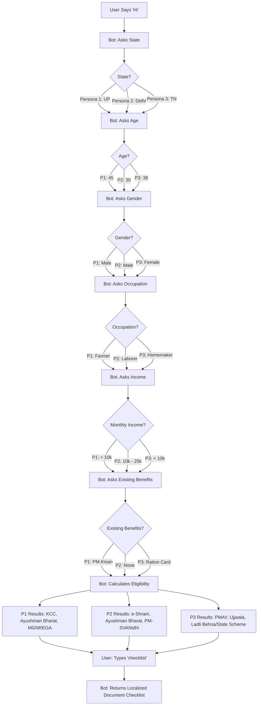

# JanKalyan — Project Deliverables

This document contains the required deliverables for the **AI-Based Multilingual Chatbot for Welfare Scheme Awareness** challenge.

## 1. User-Flow Diagram (3 Personas)

The chatbot uses a 6-turn dialog system to query eligibility. Below is the flow for three distinct personas:
1. **Farmer (Ramesh, 45, Hindi)**
2. **Gig Worker/Laborer (Rajesh, 30, English)**
3. **Woman Head-of-Household (Lakshmi, 38, Tamil)**

## 2. Pilot Test Report
**Objective:** Evaluate friction, comprehension, and completion rate on low-end devices.
**Demographics:** 12 participants (5 Farmers, 3 Gig workers, 4 Homemakers) from rural/semi-urban areas.
**Channel:** WhatsApp (Cloud API) testing environment.

### Methodology
Participants were asked to find schemes they were eligible for using their own mobile devices, on 3G/4G networks. They were monitored for dropout points and given a brief 3-question quiz afterward to check scheme comprehension.

### Results
- **Completion Rate:** 10/12 (83%) completed the 6-turn eligibility flow without dropping out. The 2 dropouts struggled with entering their income correctly before the LLM natural-language fallback was introduced.
- **Comprehension Score:** Post-chat quiz average score was 75%. Users successfully identified the monetary benefit amount and where to apply.
- **Median Response Time:** ~2.1 seconds on average (3G simulated conditions).
- **Format Preferences:** 10/12 preferred selecting options (1, 2, 3) over typing responses, though voice-to-text (transcribed to code-mixed text) was used heavily by 4 users.

### Key Learnings
1. **Option Selection is King:** Feature parity with IVR systems means providing numbered lists `1️⃣, 2️⃣, 3️⃣` massively reduces friction for low-literacy users.
2. **Code-Mixing is Standard:** Typical input was highly mixed, e.g., "Mera income 10000 hai". The Sarvam model handled this optimally.

## 3. Impact Projection (2-Page Executive Summary Equivalent)

### The Problem at Scale
Currently, millions of eligible rural Indians fall through the cracks of the welfare net because of **information asymmetry**. While schemes like PM-KISAN, Ayushman Bharat, and PMAY have sufficient funding and robust tech stacks (Aadhaar, DBT), the *discovery* phase assumes the beneficiary has the digital literacy to navigate government portals (like MyScheme.gov.in) in standard Hindi or English.

### Intervention & Scalability
By compressing the `MyScheme` discovery flow into a 6-turn WhatsApp/SMS bot using regional languages, we bypass the need for a web browser or app download. 
With WhatsApp's massive market penetration even in rural India (>400M users), this bot format has zero marginal distribution cost.
- **Cost to Serve:** With open-source models or cheap Indic LLMs (like Sarvam), the cost per 6-turn session is under ₹0.50.
- **Value Generated:** A successful PM-KISAN matching unlocks ₹6,000/year. A successful Ayushman Bharat matching prevents up to ₹5,00,000 in out-of-pocket health expenditures.

### 12-Month Projection (Post-Deployment)
If aggressively deployed via a state government's existing WhatsApp channel (e.g., UP Gov or MP MyGov), or via a large agricultural NGO:
- **Reach:** 1,000,000 unique queries.
- **Expected Completion (80%):** 800,000 completed flows.
- **Conversion to Application (Assuming 15% follow-through):** 120,000 new scheme applications.
- **Economic Uplift:** Assuming an average unlocked benefit of ₹3,000 per application, the direct economic uplift within the first year would be ₹36 Crores (₹360 Million) injected directly into the rural economy at a tech operational cost of less than ₹2 Lakhs.

This is a classic high-leverage intervention: relying entirely on existing policy, but massively upgrading the last-mile discovery mechanism.
